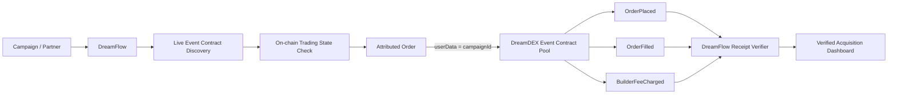

# DreamFlow

**Growth rails for DreamDEX.**

DreamFlow attributes real Event Contract orders to the channel that generated them using DreamDEX's native on-chain userData field, and activates Builder Code monetization when the live pool permits it.

---

## Quick Links

- **Live Demo:** (Deploy URL pending)
- **Proof Transaction:** [`0xf963e78106461c5184811c49f6a2bb8abb748ace11c51b194c85ace4492a211a`](https://shannon-explorer.somnia.network/tx/0xf963e78106461c5184811c49f6a2bb8abb748ace11c51b194c85ace4492a211a) (Block 485731720)
- **Developer Feedback & Bug Report:** [FEEDBACK.md](file:///c:/Users/yyash/Coding/DreamFlow/FEEDBACK.md)
- **Protocol Mode:** Mode B (Attribution Active, Live Pool Builder Cap: 0 bps)
- **Network:** Somnia Shannon testnet (50312)
- **Hackathon:** Somnia × DreamDEX Event Contracts

---

## 30-Second Judge Path

1. Open `/trade` page
2. Connect Shannon wallet
3. Select CryptoBrief campaign (userData = 1001)
4. Place small UP order
5. Wait for confirmation
6. View "VERIFIED ON-CHAIN ✓" receipt
7. Confirm `OrderPlaced.userData = 1001` in transaction
8. Open Shannon Explorer, verify tx
9. Open `/dashboard` to see verified order
10. Open `/verify`, paste tx hash, verify attribution decodes from scratch

---

## Why DreamFlow

**Most hackathon submissions optimize:**
- What should I trade?
- How should I trade?
- How can AI trade?

**DreamFlow asks:**
- Where did real DreamDEX trading activity come from?
- How can the application that drove it monetize that activity?

**The Core Insight:**

DreamDEX Event Contract orders expose an arbitrary `uint64 userData` field. DreamFlow uses that field as an on-chain campaign identifier.

```ts
const CAMPAIGNS = {
  cryptoBrief: {
    id: 1001n,
    label: "CryptoBrief",
  },

  bossRaid: {
    id: 2001n,
    label: "BossRaid",
  },
};
```

A DreamDEX Event Contract order can therefore carry:

```text
userData = 1001
```

DreamFlow verifies that value from the actual `OrderPlaced` transaction event.

---

## 2. Fill-Level Analytics

DreamFlow measures blockchain activity rather than browser events.

The dashboard can show verified:

- orders,
- fills,
- campaign IDs,
- markets,
- wallets,
- volume,
- builder fees,
- transaction hashes.

Each row can be traced back to its Shannon transaction.

```text
Campaign       Orders     Filled Volume     Builder Fees
CryptoBrief       2           4.83 tUSDC         —
BossRaid          1           1.21 tUSDC         —
```

Only real verified transactions are displayed.

No fake traction or seeded revenue data is used.

---

## 3. Native Builder Monetization

DreamDEX supports optional Builder Codes through:

```text
builder
builderFeeBpsTimes1k
```

When supported by the live Event Contract pool, DreamFlow can route an order with both:

```text
userData → acquisition attribution
builder  → monetization
```

The user explicitly approves the maximum builder fee before the tagged order is placed.

Successful tagged fills can emit:

```solidity
BuilderFeeCharged(...)
```

which gives DreamFlow an independently verifiable source of builder revenue.

### Runtime capability detection

DreamFlow never assumes Builder Codes are enabled.

For every newly discovered pool it reads:

```solidity
getMaxBuilderFeeBpsTimes1k()
```

If the result is `0`, monetization is transparently disabled while campaign attribution continues to work normally.

---

# Architecture



---

# Built Natively for DreamDEX Event Contracts

DreamFlow is not a generic prediction-market analytics wrapper.

The implementation is designed around DreamDEX's actual Event Contract lifecycle.

### Dynamic market discovery

DreamFlow discovers currently active Event Contracts instead of hardcoding a pool.

Preferred demo markets:

```text
BTC
ETH
```

---

### On-chain execution guard

Indexer data is useful for discovery, but DreamFlow verifies the authoritative market state on-chain immediately before trading.

Orders are submitted only when:

```text
status = Trading
```

---

### `marketId`-keyed state

DreamDEX pools can be reused across Event Contract windows.

DreamFlow therefore keys application state by:

```text
marketId
```

rather than assuming one pool always represents one market.

When a window rolls:

```text
old market
    ↓
marketId changes
    ↓
quotes cleared
builder state refreshed
order book refreshed
new market selected
```

---

### Tick and lot validation

Before execution DreamFlow validates:

- tick size,
- lot size,
- minimum quantity,
- market expiry,
- order expiry,
- collateral balance,
- wallet gas balance.

---

### IOC execution

Demo trades use Immediate-Or-Cancel orders against the current live order book.

A buy must actually cross the current ask.

DreamFlow does not treat an arbitrary zero price as a market order.

---

# Transaction Verification

After confirmation DreamFlow fetches the receipt and decodes the relevant pool events.

The minimum attribution proof is:

```text
Transaction success           ✓
OrderPlaced                   ✓
Order userData                1001
Expected campaign             1001
Attribution verified          ✓
```

Where available it also decodes:

```text
OrderFilled
BuilderFeeCharged
```

Example verified receipt:

```text
VERIFIED ON-CHAIN ✓

Campaign      CryptoBrief
Campaign ID   1001
Market        BTC
Side          UP
Network       Somnia Shannon
Order ID      ...
Transaction   0x...
userData      1001 ✓
```

---

# Independent Transaction Verifier

DreamFlow includes a verifier that reconstructs attribution directly from a Shannon transaction hash.

```text
/verify
```

Paste a transaction hash:

```text
0x...
```

DreamFlow:

1. fetches the receipt,
2. decodes DreamDEX events,
3. finds `OrderPlaced`,
4. extracts `userData`,
5. resolves the campaign,
6. verifies fills and builder events.

This proves that attribution does not depend on DreamFlow's local application database.

---

# Example Use Cases

### Media

A crypto publication can determine which article drove an actual DreamDEX trade.

```text
Article
→ campaign 1001
→ Event Contract order
→ verified conversion
```

### Games

A game can distinguish between players who opened a prediction UI and players who actually traded.

### Wallets

A wallet can compare which market placement produces genuine DreamDEX activity.

### Creators

Creators can receive unique campaign identities and measure real conversions rather than referral clicks.

### Trading Applications

Trading tools can attribute partner integrations and distribution channels using native order metadata.

---

# Tech Stack

### Frontend

- Next.js
- TypeScript
- Tailwind CSS
- React

### Blockchain

- Somnia Shannon
- DreamDEX Event Contracts
- `@somnia-chain/markets-sdk`
- viem

### Verification

- transaction receipt decoding
- DreamDEX Event Contract events
- native `userData`
- optional Builder Code events

---

# Network

## Somnia Shannon

```text
Chain ID:
50312

RPC:
https://dream-rpc.somnia.network

Explorer:
https://shannon-explorer.somnia.network
```

---

# Test Collateral

DreamDEX Event Contracts on Shannon use test USDC.

```text
tUSDC
0x70a86D8842FB63C4Ad2b7cdddF530eBf1BB25d8E
```

Decimals:

```text
6
```

The Shannon tUSDC contract exposes a faucet for development collateral.

Native Shannon STT is still required to pay transaction gas.

---

# Protocol Addresses

```text
BinaryMarketsModule
0x3ecC694Cef705358864a646142ac17A90E29e388

MarketsCore
0x2802504314685D89bF6C992CA5a8e7cC78bc0294

BinarySettlement
0xbF4a49e0Dfd092e5FBE8E5761064C49533e6Ed23

OutcomeToken6909
0xB52c5934113Af5c0Bb20eb3C72290C8215f755b9

OracleHub
0xe40db387cC98601Dd11bd634fF2f3AD5686dE32b

CollateralRouter
0xbC0C9834B15ACE38bB50dDaa7d7f7C7CC4DC183C
```

Individual Event Contract markets and pools are dynamically discovered.

They are not hardcoded.

---

# Local Development

## Requirements

```text
Node.js 20+
npm
Browser EVM wallet
Somnia Shannon STT
```

Clone:

```bash
git clone ADD_GITHUB_URL
cd dreamflow
```

Install:

```bash
npm install
```

Verify the DreamDEX SDK:

```bash
npm ls @somnia-chain/markets-sdk
```

DreamFlow expects:

```text
@somnia-chain/markets-sdk >= 0.28.0
```

Create environment file:

```bash
cp .env.example .env.local
```

Run:

```bash
npm run dev
```

Open:

```text
http://localhost:3000
```

---

# Environment

Example:

```dotenv
NEXT_PUBLIC_SOMNIA_RPC_URL=https://dream-rpc.somnia.network
NEXT_PUBLIC_SOMNIA_CHAIN_ID=50312
NEXT_PUBLIC_SOMNIA_EXPLORER=https://shannon-explorer.somnia.network

NEXT_PUBLIC_BUILDER_ADDRESS=
NEXT_PUBLIC_DEFAULT_CAMPAIGN_ID=1001
```

Development CLI scripts may optionally use:

```dotenv
PROBE_PRIVATE_KEY=
```

Never expose that value through `NEXT_PUBLIC_*`.

Never commit `.env.local`.

---

# Development Commands

```bash
npm run dev
```

Run development server.

```bash
npm run typecheck
```

TypeScript verification.

```bash
npm run lint
```

Lint project.

```bash
npm test
```

Run tests.

```bash
npm run build
```

Production build.

If available:

```bash
npm run probe
```

Runs the DreamFlow protocol probe.

The probe verifies:

```text
SDK
wallet
STT
tUSDC
live market
on-chain state
order book
builder cap
attributed order
receipt
userData
fill
builder event
```

---

# Campaign Example

A campaign URL may look like:

```text
https://dreamflow.app/trade?campaign=1001
```

DreamFlow resolves:

```text
1001 → CryptoBrief
```

The resulting order carries:

```text
userData = 1001
```

The chain becomes the attribution proof.

---

# Judge Path

## Review DreamFlow in 3 minutes

1. Open the live application.
2. Go to **Trade**.
3. Connect a Somnia Shannon wallet.
4. Select `CryptoBrief — Campaign 1001`.
5. Choose UP or DOWN.
6. Place a small testnet Event Contract order.
7. Wait for confirmation.
8. Inspect the **Verified On-Chain** receipt.
9. Confirm:

```text
userData = 1001
```

10. Open the Shannon explorer transaction.
11. Open the DreamFlow dashboard.
12. Paste the transaction into `/verify`.

If Builder Codes are enabled by the live pool, also inspect the builder fee approval and `BuilderFeeCharged` proof.

---

# What Is Real

DreamFlow is intentionally strict about claims.

### Verified / intended to be verified in the live prototype

- live DreamDEX Event Contract discovery,
- Somnia Shannon execution,
- authoritative on-chain market state,
- campaign attribution through `userData`,
- `OrderPlaced` decoding,
- transaction verification,
- rollover-safe market handling,
- Builder Code capability detection,
- Builder Code fees only when supported by the live pool.

### Not claimed

- AI prediction accuracy,
- guaranteed trading profitability,
- fake users,
- fake trading volume,
- fake builder revenue,
- mainnet production scale,
- guaranteed Builder Code availability on every Event Contract pool.

See:

```text
CLAIMS.md
```

for the full evidence table.

---

# Why DreamFlow Matters to the Ecosystem

Without measurable acquisition, ecosystem growth becomes guesswork.

A DreamDEX application may know:

```text
10,000 people viewed a page.
```

But that does not answer:

```text
Which source actually produced traders?
```

DreamFlow turns that funnel into something verifiable:

```text
campaign
   ↓
order
   ↓
fill
   ↓
revenue
```

That gives builders a better foundation for:

- partnerships,
- creator distribution,
- paid acquisition,
- wallet integrations,
- media integrations,
- agent integrations,
- revenue sharing,
- ecosystem growth.

The blockchain itself provides the conversion proof.

---

# Hackathon Fit

DreamFlow is designed to score directly against the hackathon criteria.

| Criterion | DreamFlow |
|---|---|
| **Technical Implementation** | Real Event Contract execution, receipt decoding, `userData`, status gating, rollover safety |
| **Innovation** | Acquisition attribution and monetization infrastructure rather than another prediction/trading strategy |
| **UX & Design** | Simple campaign → trade → verified receipt flow |
| **Business / Ecosystem Impact** | Makes DreamDEX distribution measurable and creates a path to builder economics |
| **Presentation** | A single real transaction demonstrates the core product end-to-end |

---

# SDK & Documentation Feedback

During development we document protocol and SDK friction encountered while building a real application.

See:

```text
SDK_FEEDBACK.md
```

Topics may include:

- Event Contract metadata examples,
- Builder Code runtime capability detection,
- `userData`,
- receipt shapes,
- binary order execution,
- rollover handling,
- environment-specific collateral decimals.

Only issues actually encountered are included.

---

# Repository Guide

```text
app/
  page.tsx
  trade/
  dashboard/
  integrations/
  verify/

components/
  LiveMarketCard.tsx
  TradePanel.tsx
  CampaignSelector.tsx
  BuilderStatus.tsx
  VerifiedReceipt.tsx
  AttributionTable.tsx

lib/
  dreamdex/
  attribution/
  wallet/

scripts/
  inspect-sdk.ts
  probe.ts
  verify-tx.ts

proof/
  latest.json

README.md
JUDGES.md
CLAIMS.md
SDK_FEEDBACK.md
PROGRESS.md
```

Actual repository structure may differ slightly as implementation evolves.

---

# Roadmap

The hackathon prototype focuses on proving the primitive.

Potential next steps:

- hosted multi-project campaign registry,
- attribution API,
- partner dashboards,
- builder revenue accounting,
- signed campaign configuration,
- SDK package for third-party applications,
- automated revenue sharing,
- cross-application acquisition analytics,
- production mainnet support.

The immediate goal remains deliberately narrow:

> **Make one real DreamDEX conversion independently verifiable.**

---

# Security

DreamFlow does not require custody of user funds.

Browser trading uses the connected wallet.

Private keys used by development scripts must never be:

- committed,
- exposed client-side,
- logged,
- included in repository documentation.

All production-facing blockchain actions require explicit wallet authorization.

---

# License

MIT

---

## DreamFlow

**Attribute the order. Verify the conversion. Grow DreamDEX.**
