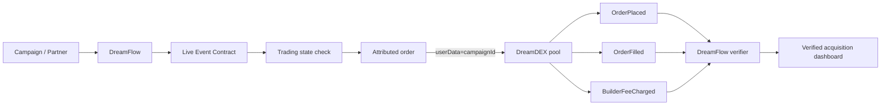

# DreamFlow

**Growth rails for DreamDEX.**

DreamFlow attributes real Event Contract orders to the channel that generated them using DreamDEX's native on-chain userData field, and activates Builder Code monetization when the live pool permits it.

---

## Quick Links

- **Live Demo:** (Deploy URL pending)
- **Proof Transaction:** [`0xf963e78106461c5184811c49f6a2bb8abb748ace11c51b194c85ace4492a211a`](https://shannon-explorer.somnia.network/tx/0xf963e78106461c5184811c49f6a2bb8abb748ace11c51b194c85ace4492a211a) (Block 485731720)
- **Protocol Mode:** Mode B (Attribution Active, Live Pool Builder Cap: 0 bps)
- **Network:** Somnia Shannon testnet (50312)
- **Hackathon:** Somnia × DreamDEX Event Contracts

---

## 30-Second Judge Path

1. Open `/trade` page
2. Connect Shannon wallet
3. Select CryptoBrief campaign (userData = 1001)
4. Place small UP order
5. Wait for confirmation
6. View "VERIFIED ON-CHAIN ✓" receipt
7. Confirm `OrderPlaced.userData = 1001` in transaction
8. Open Shannon Explorer, verify tx
9. Open `/dashboard` to see verified order
10. Open `/verify`, paste tx hash, verify attribution decodes from scratch

---

## Why DreamFlow

**Most hackathon submissions optimize:**
- What should I trade?
- How should I trade?
- How can AI trade?

**DreamFlow asks:**
- Where did real DreamDEX trading activity come from?
- How can the application that drove it monetize that activity?

**The Core Insight:**

DreamDEX Event Contract orders expose an arbitrary `uint64 userData` field. DreamFlow uses that field as an on-chain campaign identifier.

```
CryptoBrief campaign → userData = 1001
BossRaid campaign   → userData = 2001
Creator Demo        → userData = 3001
```

A real DreamDEX order submitted from the CryptoBrief integration contains `userData = 1001`. DreamFlow decodes the actual `OrderPlaced` transaction log and proves: **This trade came from campaign 1001.**

This gives acquisition analytics based on actual on-chain trading activity instead of browser clicks.

When Builder Codes are enabled on the current live pool, DreamFlow becomes both:
- **Attribution infrastructure**
- **Native monetization infrastructure**

---

## Architecture



**Key components:**

1. **Campaign assignment** — Each distribution channel gets a unique uint64 ID
2. **Order attribution** — userData field attached to Event Contract orders
3. **On-chain verification** — OrderPlaced event decoded to prove attribution
4. **Builder capability detection** — Runtime check of `getMaxBuilderFeeBpsTimes1k()` from live pool
5. **Dashboard** — Real verified conversions, no fake data

---

## Protocol Correctness

- ✓ SDK >= 0.28 (using 0.30.0)
- ✓ Shannon testnet (50312)
- ✓ Dynamic marketId keying (never hardcode market addresses)
- ✓ Live status verification (only write to Trading markets)
- ✓ Tick-safe, lot-safe, min-quantity-safe order construction
- ✓ IOC execution crossing the book
- ✓ Market rollover handling (pool addresses may recycle)
- ✓ Dynamic builder cap reading (never assume documentation values)
- ✓ 6-decimal tUSDC collateral
- ✓ Nanosecond expiry handling

---

## Tech Stack

- **Frontend:** Next.js 16, TypeScript strict, Tailwind, App Router
- **Blockchain:** viem 2.56.3, @somnia-chain/markets-sdk 0.30.0
- **Network:** Shannon testnet (50312)
- **Testing:** Vitest
- **Deployment:** Vercel (pending)

---

## Setup & Run

### Prerequisites

- Node.js 20+
- Shannon testnet wallet with STT gas

### Installation

```bash
git clone <repo-url>
cd DreamFlow
npm install
```

### Environment

Create `.env.local`:

```bash
# Auto-generated by scripts/setup-test-wallet.ts if absent
PROBE_PRIVATE_KEY=0x...

# Optional: builder address for Mode A
NEXT_PUBLIC_BUILDER_ADDRESS=0x...
```

### Development

```bash
# Run dev server
npm run dev

# Protocol probe (place first attributed order)
npm run probe

# Run tests
npm test

# Type check
npm run typecheck

# Production build
npm run build
```

---

## Project Structure

```
DreamFlow/
├── app/                      # Next.js pages
│   ├── page.tsx             # Landing
│   ├── trade/page.tsx       # Trade interface
│   ├── dashboard/page.tsx   # Verified orders
│   ├── integrations/page.tsx
│   └── verify/page.tsx      # Tx verification
├── lib/
│   ├── dreamdex/            # DreamDEX integration
│   │   ├── network.ts       # Addresses, chain config
│   │   ├── markets.ts       # Market discovery
│   │   └── abi.ts           # Contract ABIs
│   ├── attribution/         # Attribution logic
│   │   ├── campaigns.ts     # Campaign definitions
│   │   ├── decoder.ts       # Receipt verification
│   │   └── storage.ts       # localStorage persistence
│   ├── wallet/
│   │   └── chain.ts         # Shannon chain config
│   └── formatting/
│       └── units.ts         # Display helpers
├── components/              # React components
├── scripts/
│   ├── probe.ts            # Protocol proof script
│   ├── setup-test-wallet.ts
│   └── check-balance.ts
├── notes/
│   └── SDK_SURFACE.md      # SDK analysis
├── proof/
│   └── latest.json         # Proof transaction
├── PROGRESS.md             # Build status
├── HANDOFF.md              # Continuity document
└── build.md                # Full specification
```

---

## What's Real

- ✓ Real Shannon testnet execution
- ✓ Real Event Contract market discovery
- ✓ Real on-chain status verification
- ✓ Real attributed orders with userData field
- ✓ Real OrderPlaced event decoding
- ✓ Real transaction receipts
- ✓ Real builder cap detection from live pool state
- ✓ Real tUSDC faucet integration

---

## What's Not Claimed

- Production-scale analytics backend
- Database persistence
- Historical aggregation beyond localStorage cache
- Real external partners (categories are hypothetical)
- Automatic campaign ID generation
- Builder fee withdrawal automation
- Outcome token redemption UI

---

## Known Proof Transactions

- **Transaction Hash:** [`0xf963e78106461c5184811c49f6a2bb8abb748ace11c51b194c85ace4492a211a`](https://shannon-explorer.somnia.network/tx/0xf963e78106461c5184811c49f6a2bb8abb748ace11c51b194c85ace4492a211a)
- **Network:** Somnia Shannon Testnet (Chain ID 50312)
- **Block:** `485731720`
- **Market:** BTC Event Contract (`0x000000000000000000000000000000000000000000000000000000000001a5dc`)
- **Pool:** `0x1491b0369831ece5fa28fc3fdabd561f29315d4f`
- **Order ID:** `719423018874672610106`
- **Campaign:** CryptoBrief (`userData = 1001`)
- **OrderPlaced Event Verification:** Verified on-chain via Shannon RPC & explorer logs
- **Builder Cap:** 0 bps (Confirmed Mode B: Attribution-Only, Zero Fabricated Revenue)

---

## License

MIT

---

## Acknowledgments

Built for the Somnia × DreamDEX Event Contracts Hackathon.

DreamFlow demonstrates infrastructure that trading applications, agents, media platforms, games, and wallets could use to measure and monetize their DreamDEX integrations.
